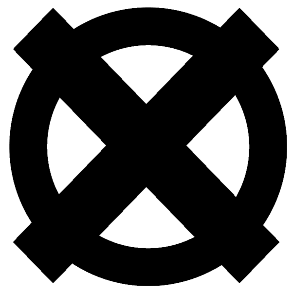

# 

# Regles
## Début de partie
Un partie est consitué de 2 manches.
- Lors de la première manche c'est le joueur X qui commence.
- Lors de la seconde manche c'est le joueur O qui commence.
Chaque joueur joue chacun son tour.
Le joueur gagnant, c'est celui qui a gagné le plus de manche.

## Jouabilité
Quand c'est notre tour, avec un clique sur un pion, les mouvements sont affiché par une croix et un rond.

Pour déplacer le poin, il suffit de rester appuyé dessus, et de déposer vers la prochaine case, attention lorsqu'un mouvement n'est pas validen le pion ne bouge pas.

## Mouvements
Les pions peuvent aller uniquement en avant, c'est à dire que les pions X peuvent uniquement bouger vers la droite, et le pions O, uniquement vers la gauche.
Un pion seul ne peux bouger que devant et en diagonal.

Lorsqu'un pion du même camp est devant, le pion derriere peu bouger au dessus, en dessous, devant et en diagonal du pion allié.

Un pion peut bloquer un autre pion et l'empecher de bouger, en étant a coté (au dessus, en dessous, devant, derrière). Et le pion ne peu plus bouger.

> Ici le pion X est bloqué puisque un pion enemis le bloque, il ne peut donc pas bouger

Un pion peut être capturé en se déplacant dessus.  

## Victoire
- Si un joueur n'a plus de pion, ou tous ces pions sont bloqué, il perd.
- Si les 2 joueurs sont bloqué, c'est celui qui a le plus de pion qui gagne.
- Si les 2 joueurs ont le même nombre de pion, il y a une égalité.