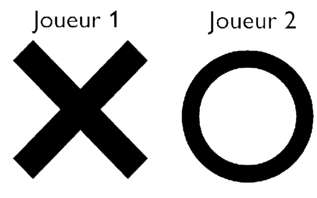

# 

# Regles
## Jeux 
Chaque joueur joue à tour de rôle.

Pion du joueur 1 :

## Début de partie
Une partie se compose de 2 manches.
- Lors de la première manche, c'est le joueur X qui commence.
- Lors de la seconde manche, c'est le joueur O qui commence.

Le joueur gagnant est celui qui remporte le plus de manches.

## Jouabilité
Lorsque c'est notre tour, en cliquant sur un pion, les mouvements possibles sont affichés par une croix et un rond.

Pour déplacer le pion, il suffit de rester appuyé dessus et de le glisser vers la case suivante. Attention, si un mouvement n'est pas valide, le pion ne bouge pas.

## Mouvements
### Base
Les pions peuvent avancer uniquement vers l'avant. Les pions X ne peuvent bouger que vers la droite et les pions O uniquement vers la gauche. Un pion seul peut se déplacer uniquement en avant et en diagonale.

### Pions seuls

Lorsqu'un pion du même camp est devant, le pion arrière peut se déplacer au-dessus, en dessous, devant ou en diagonale par rapport au pion allié.

### Avec pion allié devant

> Ici, les pions arrière (le pion X le plus à droite, le pion O le plus à gauche) ont plus de mouvements possibles.
> Les pions devant, ont les meme mouvements qu'un pion seul.

### Pion bloqué
Un pion peut bloquer un autre pion et l'empêcher de bouger en étant à côté (au-dessus, en dessous, devant, derrière). Le pion ne peut alors plus se déplacer.

> Ici, le pion X est bloqué car un pion ennemi le bloque, il ne peut donc pas bouger.

### Pion capturé
Un pion peut être capturé en se déplaçant dessus.  

> Ici, le pion O se déplace sur le pion X, capturant ainsi le pion X

## Victoire
- Si un joueur n'a plus de pion, ou tous ces pions sont bloqué, il perd.
- Si les 2 joueurs sont bloqué, c'est celui qui a le plus de pion qui gagne.
- Si les 2 joueurs ont le même nombre de pion, il y a une égalité.

# Création

# License